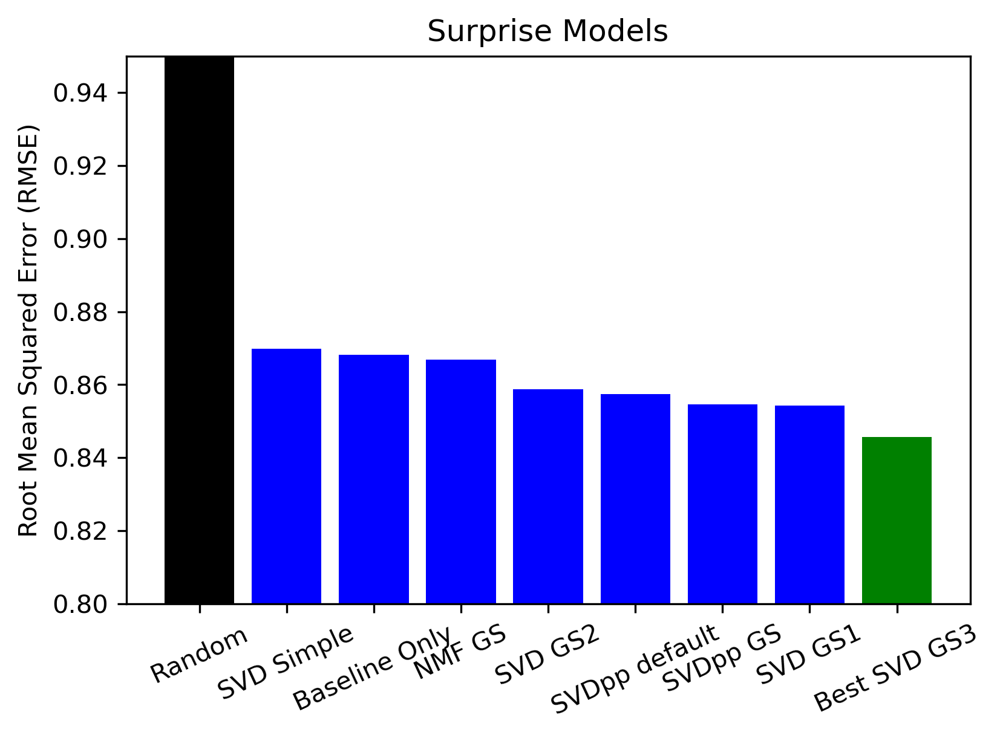

# MovieLens Recommendation System

Authors: Samuel Robins, Jon McCaffrey

# Contents

### 1. [Overview](#overview)
### 2. [Business and Data Understanding](#bidness)
### 3. [Data Preparation](#dataprep)
### 4. [Modeling](#modeling)
### 5. [Final Model Evaluation](#final)
### 6. [Summary](#summary)

# Overview

Using the __["small" dataset](https://grouplens.org/datasets/movielens/latest/)__ from __[MovieLens](https://movielens.org/)__, which contains explicit user ratings, movie titles, genres, etc., we were able to produce a model-based collaborative filtering recommendation system that allows for user input and will return the top 5 recommendations of movies from the dataset that the use has not yet rated.  Our process involved using the Surprise Python scikit library to process data and iterate through multiple recommender algorithms (including SVD and SVD++), using GridSearch, cross-validation and root mean square error (RMSE) to decide on our best-performing model.  Our final model used a tuned SVD algorithm with an RMSE of 0.8457.  We also created a content-based filtering model, using TF-IDF Vectorizer and cosine similarity, to address the "cold start" problem inherent in collaborative filtering models.  With this model, a user who is not already in the dataset can input a known movie from the dataset and be returned 5 movie recommendations to choose from.

# Business and Data Understanding

We will present to the __[JustWatch](https://www.justwatch.com/)__ streaming guide app, with the premise that they can provide movie recommendations to customers who already use their service to search across streaming platforms for a specific movie and create watchlists.  

The MovieLens small dataset contains 100,836 user ratings from 610 different users, each of whom contributed at least 20 ratings.  A total of 9,742 movie titles are included in this dataset.  There are two additional .csv files contained within the package download that we did not end up using.  One file contained 3,683 tags ("a single word or short phrase") that users applied with their numerical rating, which represented less than 4% of the total ratings in the dataset.  The other file contained links of each movie in the dataset to its listing on __[The Movie Database](https://www.themoviedb.org/)__ or on the __[Internet Movie Database](https://www.imdb.com/)__

The MovieLens dataset was specifically developed with recommendation system building in mind.  The data contains explicit user ratings, movie titles, and genres with consistent user ID and movie ID indices across files.  The business problem we were tasked with was to "build a model that provides top 5 movie recommendations to a user, based on their ratings of other movies".  Though movie recommendation systems are now common-place in the streaming apps we have available, understanding the architecture of these everyday models may allow us to expand their use into other realms, or at least refine what a model can currently provide, with the goal of delivering the most refined experience to an individual user.  

Citation included in the README.txt:  
F. Maxwell Harper and Joseph A. Konstan. 2015. The MovieLens Datasets: History and Context. ACM Transactions on Interactive Intelligent Systems (TiiS) 5, 4: 19:1–19:19. <https://doi.org/10.1145/2827872>

Additional citations at end of notebook.

# Data Preparation:

We used Pandas to explore the four different CSV files contained in the small MovieLens.org dataset.  The first file contained user IDs and explicit user ratings.  Each user was selected randomly by MovieLens, and only users with at least 20 ratings were included.  The rating scale runs from 0.5 to 5.0 in half-star increments.   The second file contained movie information, with title and genres.  As stated above, we did not use the remaining two files, one of which contained information for links to TMDB and IMDB, and the last of which included user-generated tags for a small portion (<4%) of movies.  

We combined the movies and user ratings files into one dataframe, using the common 'movieId' column.  This dataset is well-curated, with no nulls to manage in this combined dataframe.  

Next we instantiated Surprise to perform a train-test split (80/20), and started comparing different algorithms

# Modeling

We iterated through many algorithms, using cross-validation and RMSE scores to decide how to optimize our findings. 

The first step, for a baseline comparison, was to use the NormalPredictor algorithm to randomly generate ratings.  This resulted in the highest RMSE of 1.4327.  The next baseline estimated was through BaselineOnly, which utilizes Alternating Least Squares, and the RMSE was substantially better at 0.8683.  We progressed from there to using Singular Value Decomposition, starting with the default hyperparameters (RMSE 0.8698), and then utilizing GridSearchCV to try to optimize hyperparameters.  For the SVD algorithm, this took ~3 mins per GridSearch with the parameters we provided.  We adjusted n_factors (number of user & item factors considered), n_epochs (number of iterations of stochastic gradient descent), lr_all (the learning rate for all parameters), and reg_all (the regularization term for all parameters).  We also consider bias (whether to use baselines) on our first search, but kept that 'True' for the remainder.  Our best parameters yielded a model with an RMSE of 0.8457.  

To be thorough, we also considered Non-negative Matrix Factorization (NMF), as well as the SVD++ model, which is an extension of SVD taking into account implicit ratings.   NMF did not improve our findings (RMSE 0.8668).  Nor did SVD++, even utilizing a time-consuming and computationally expensive GridSearch (best RMSE 0.8545).   Below is a visual comparision of all RMSE

# Final Model Evaluation

To evaluate our final model on the full dataset and actually create a recommendation system, we had additional steps to complete.  First we built our full trainset and fit it  our best model on it.  Then we returned to Pandas dataframe and created a separate dataframe that contained each movie only once.  Next, we were able to create a separate list for a given user that contained the movies they'd already seen, and a separate dataframe of the movies they had not yet seen.  We were able to incorporate that information into a function that would return the top 5 movies for any given user that they had not yet seen.  

One limitation of any recommendation system (ours included) is the quality of the user input.  This could include rater bias (always rating highly, or consistently rating every at a low score).  It may also be beneficial to have a wider rating scale (e.g. 0-10) to allow for more granularity.  The user-generated tags are also a good idea for additional refinement of the recommendation, but <4% of our dataset contained them.  

Specifically related to model-based collaborative filtering, it is dependent on explicit user ratings, and would be unable to provide recommendations for a new user with no ratings to refer to.  To be able to offer recommendations even to a new user, we took the ooportunity to create a content-based filter, using genre-information on each movie.  This involved utilizing sklearn's TF-IDF Vectorizer and cosine similarity.  By finding the top 5 movies with the closest similarity (in genre) to a favorite movie inputted by the user, we were able to provide recommendations even for a user who has no prior movie ratings listed in the dataset.  

# Summary

In summary, we were tasked with creating a top 5 movie recommendation system to demonstrate for the JustWatch streaming guide app.  Using the "small" dataset from MovieLens, we were able to produce a model-based collaborative filtering recommendation system that allows for user input and returns the top 5 recommendations of movies from the dataset that the user has not yet rated. We primarily used the Surprise Python scikit library to process data and iterate through multiple recommender algorithms (including SVD and SVD++), using GridSearch, cross-validation and RMSE to decide on our best-performing model. Our final model used a tuned SVD algorithm with an RMSE of 0.8457. We also created a content-based filtering model, using TF-IDF Vectorizer and cosine similarity, to address the "cold start" problem inherent in collaborative filtering models. With this model, a user who is not already in the dataset can input a known movie from the dataset and be returned 5 movie recommendations to choose from.

For More Information
Please review the full analysis in our __[Jupyter Notebook](https://github.com/mccafj/MovieLens-Recommendation-System/blob/main/Final%20Notebook%20MovieLens%20Recommendation%20System.ipynb)__ or the __[PDF of our slide presentation.]()__

For any additional questions, please contact Samuel Robins sammyrobins305@gmail.com or Jon McCaffrey jonmccaffrey524@gmail.com

Repository Structure

###### ├── __[README.md](https://github.com/mccafj/MovieLens-Recommendation-System#readme)__
###### ├── __[Final Notebook MovieLens Recommendation System.ipynb](https://github.com/mccafj/MovieLens-Recommendation-System/blob/main/Final%20Notebook%20MovieLens%20Recommendation%20System.ipynb)__  <- Main notebook for project code
###### ├── __[slides.pdf]()__      <- PDF of slides for our presentation
###### ├── __[Data](https://github.com/mccafj/MovieLens-Recommendation-System/tree/main/data)__			                          <- Location of raw dataset
###### └── __[Images](https://github.com/mccafj/MovieLens-Recommendation-System/tree/main/images)__                              <- images used and generated in the project
